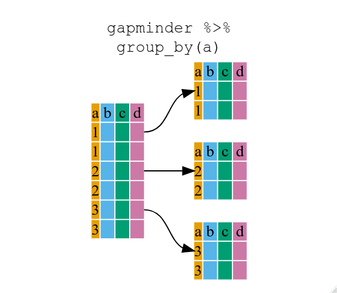
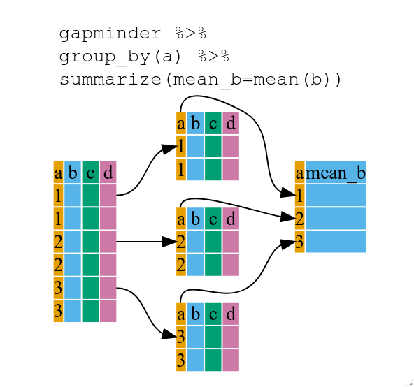

::::::::::::::::::::::::::::::::::::::: objectives

- To be able to use the six main data frame manipulation 'verbs' with pipes in  `dplyr`.
- To understand how `group_by()` and `summarize()` can be combined to summarize datasets.
- Be able to analyze a subset of data using logical filtering.
- Create new data (columns) with conditional logic

::::::::::::::::::::::::::::::::::::::::::::::::::

:::::::::::::::::::::::::::::::::::::::: questions

- How can I manipulate data frames without repeating myself?

::::::::::::::::::::::::::::::::::::::::::::::::::


The [`dplyr`](https://cran.r-project.org/package=dplyr)
package provides a number of very useful functions for manipulating data frames
in a way that will reduce the above repetition, reduce the probability of making
errors, and probably even save you some typing. As an added bonus, you might
even find the `dplyr` grammar easier to read.

:::::::::::::::::::::::::::::::::::::::::  callout

## Tip: Tidyverse

`dplyr` package belongs to a broader family of opinionated R packages
designed for data science called the "Tidyverse". These
packages are specifically designed to work harmoniously together.
Some of these packages will be covered along this course, but you can find more
complete information here: [https://www.tidyverse.org/](https://www.tidyverse.org/).

::::::::::::::::::::::::::::::::::::::::::::::::::

Here we're going to cover 5 of the most commonly used functions as well as using
pipes (`%>%`) to combine them.

1. `select()`
2. `filter()`
3. `group_by()`
4. `summarize()`
5. `mutate()`

If you have have not installed this package earlier, please do so:

```{r, eval=FALSE}
install.packages('dplyr')
```

Now let's load the package:

```{r, message=FALSE}
library("dplyr")
```

## Import data

```{r}
eiad <- read.csv("data/eyeIntegration23_meta_2023_09_01.built.csv.gz", header = TRUE)
```

## Using select()

If, for example, we wanted to move forward with only a few of the variables in
our data frame we could use the `select()` function. This will keep only the
variables you select.

```{r}
eiad_tissue <- select(eiad, sample_accession, Tissue, Source)
```

{alt='Diagram illustrating use of select function to select two columns of a data frame'}
If we want to remove one column only from the `eiad` data, for example,
removing the `Sex_Score` column.

```{r}
smaller_eiad <- select(eiad, -Sex_Score)
```

If we open up `eiad` we'll see the differences. Above we used 'normal' grammar, but the strengths of
`dplyr` lie in combining several functions using pipes. Since the pipes grammar
is unlike anything we've seen in R before, let's repeat what we've done above
using pipes.

```{r}
eiad_tissue <- eiad %>% select(sample_accession, Tissue, Source)
```

To help you understand why we wrote that in that way, let's walk through it step
by step. First we summon the gapminder data frame and pass it on, using the pipe
symbol `%>%`, to the next step, which is the `select()` function. In this case
we don't specify which data object we use in the `select()` function since in
gets that from the previous pipe. **Fun Fact**: There is a good chance you have
encountered pipes before in the shell. In R, a pipe symbol is `%>%` while in the
shell it is `|` but the concept is the same!

:::::::::::::::::::::::::::::::::::::::::  callout

## Tip: Renaming data frame columns in dplyr

Within a pipeline, the syntax is `rename(new_name = old_name)`.
For example, we may want to rename the `Cohort` column name from our `select()` statement above.

```{r}
renamed_eiad <- eiad %>% rename(group = Cohort)

head(renamed_eiad)
```

::::::::::::::::::::::::::::::::::::::::::::::::::

## Using filter()

Now we can filter to only certain kinds of tissues

```{r}
retina_eiad <- eiad %>%
  filter(Tissue == "Retina") %>%
  select(sample_accession, Tissue, Sub_Tissue, Source, Age)
head(retina_eiad)
```

If we now want to show retina samples that are not adult

```{r}
retina_eiad %>%
  filter(Age != 'Adult')
```

:::::::::::::::::::::::::::::::::::::::  challenge

## Challenge 1

Write a single command (which can span multiple lines and includes pipes) that
will produce a data frame that has the cornea adult data sourced from "Primary culture" (hint "Source"). 

Only keep the sample_accession, study_accession, tissue, and sub_tissue columns

How many rows does it have?

:::::::::::::::  solution

## Solution to Challenge 1

```{r}
eiad_challenge1 <- eiad %>%
  filter(Tissue == "Cornea",
         Source == 'Primary culture') %>%
  select(sample_accession, study_accession, Tissue, Sub_Tissue)
```

:::::::::::::::::::::::::

::::::::::::::::::::::::::::::::::::::::::::::::::

As with last time, first we pass the eiad data frame to the `filter()`
function, then we pass the filtered version of the gapminder data frame to the
`select()` function. **Note:** The order of operations is very important in this
case. If we used 'select' first, filter would not be able to find the variable
continent since we would have removed it in the previous step.

## Using group_by()

Now, we were supposed to be reducing the error prone repetitiveness of what can
be done with base R, but up to now we haven't done that since we would have to
repeat the above for each tissue Instead of `filter()`, which will only pass
observations that meet your criteria we
can use `group_by()`, which will essentially use every unique criteria that you
could have used in filter.

{alt='Diagram illustrating how the group by function organizes a data frame into groups'}

## Using summarize()

The above was a bit on the uneventful side but `group_by()` is much more
exciting in conjunction with `summarize()`. This will allow us to create new
variable(s) by using functions that repeat for each of the tissue
data frames. That is to say, using the `group_by()` function, we split our
original data frame into multiple pieces, then run functions on each piece.

Here we use the `n()` function which counts observations per group

```{r}
eiad_by_tissue <- eiad %>%
  group_by(Tissue) %>%
  summarize(Count = n())
```

{alt='Diagram illustrating the use of group by and summarize together to create a new variable'}

# Joins

The superpower of data science

Now we are going to pull in a *new* dataset - the count values of a few select genes from those samples in eyeIntegration

```{r}
library(readr)
eiad_expression <- read_csv('https://github.com/davemcg/2024_04_20_NEI_Vision_Course/raw/main/guides/data/eiad_gene_expression.csv.gz')
head(eiad_expression)
```

## OK, how to link this to our exisisting metadata file??????

With a "join"

Four major types of mutating joins:

left, right, inner, outer (full)


```{r}
eiad_join <- eiad %>% 
  left_join(eiad_expression, by = c('sample_accession' = 'name')) 

eiad_join %>% sample_n(10)

nrow(eiad_join)
```

## Why are there so many rows????

The `eiad_expression` object has `r eiad_expression %>% nrow()`!

Well, how many rows is in the eiad object?

```{r}
nrow(eiad)
```

Ah, why are they so different in size?

Easiest way to check is to count the number of number of unique values for each column.

Two functions here:
`summarise_all` is a variant of `summarise` which works across *all* columns and
`n_distinct` counts unique values in each

How did I know this code bit? Well, [google](https://stackoverflow.com/questions/22196078/count-unique-values-for-every-column).
```{r}
eiad %>% summarise_all(n_distinct)
```


OK, so we see there are a few suspicious columns:
- run_accession
- sample_title
- gtex_sra_run_accession

Let's drop them and see how many rows we have

We can pick columns with `select`. How do we..un-pick columns? With `R` there are 
two kinds of "negation" symbols: `-` and `!`

```{r}
eiad %>% select(-run_accession, -sample_title, -gtex_sra_run_accession) %>% nrow()
```

Why didn't that work? Because rows are not automatically discarded if they are identical
```{r}
eiad %>% select(-run_accession, -sample_title, -gtex_sra_run_accession) %>% 
  unique() %>% 
  nrow()
```

## Putting it all together

```{r}
eiad_meta_exp <- eiad %>% 
  select(-run_accession, -sample_title, -gtex_sra_run_accession) %>% 
  unique() %>% 
  left_join(eiad_expression, by = c('sample_accession' = 'name')) 

nrow(eiad_meta_exp)
```


# OK, back to dplyr discussion

Do you remember `group_by` and `summarize`?

Well, how about we use these again, with our new gene expression values?

## Average expression of Rho by Tissue

```{r}
eiad_meta_exp %>% 
  group_by(Tissue) %>% 
  summarise(Rho = mean(`RHO (ENSG00000163914)`))
```

## Average expression of Rho by Tissue, but in order of expression

```{r}
eiad_meta_exp %>% 
  group_by(Tissue) %>% 
  summarise(Rho = mean(`RHO (ENSG00000163914)`)) %>% 
  arrange(Rho)
```

## Average expression of Rho by Tissue, but in order of expression

Hmm, I'd rather have the highest expressing tissues first. Let's try the "negate" thingy
```{r}
eiad_meta_exp %>% 
  group_by(Tissue) %>% 
  summarise(Rho = mean(`RHO (ENSG00000163914)`)) %>% 
  arrange(-Rho)
```


## Loads of functions available

```{r}
eiad_meta_exp %>% 
  group_by(Tissue) %>% 
  summarise(Rho_mean = mean(`RHO (ENSG00000163914)`),
            Rho_med = median(`RHO (ENSG00000163914)`),
            Rho_max = max(`RHO (ENSG00000163914)`),
            Rho_min = min(`RHO (ENSG00000163914)`),
            Rho_sd = sd(`RHO (ENSG00000163914)`),
            Rho_3Q = quantile(`RHO (ENSG00000163914)`, probs = 0.75)
  ) %>% 
  arrange(-Rho_mean)
```

## You can `group_by` multiple columns! 
```{r}
eiad_meta_exp %>% 
  group_by(Tissue, Sub_Tissue, Source) %>% 
  summarise(Rho_mean = mean(`RHO (ENSG00000163914)`),
            Rho_med = median(`RHO (ENSG00000163914)`),
            Rho_max = max(`RHO (ENSG00000163914)`),
            Rho_min = min(`RHO (ENSG00000163914)`),
            Rho_sd = sd(`RHO (ENSG00000163914)`),
            Rho_3Q = quantile(`RHO (ENSG00000163914)`, probs = 0.75)
  ) %>% 
  arrange(-Rho_mean)
```


# Using `mutate()` to add *new* columns
```{r}
eiad_meta_exp %>% 
  mutate(DataProcesserWidget = 'David McGaughey',
         ProcessingDate = '2024-04-20') %>% 
  sample_n(10)
```

# Using `mutate()` with `case_when()` to make new columns with *conditional* logic
```{r}
eiad_meta_exp %>% 
  mutate(QualityRetina = case_when(`RHO (ENSG00000163914)` > 8 ~ 'Good Stuff')) %>% 
  select(sample_accession, study_accession, Tissue, `RHO (ENSG00000163914)`, QualityRetina)
```

## Now mix it with some filtering
```{r}
eiad_meta_exp %>% 
  mutate(QualityRetina = case_when(`RHO (ENSG00000163914)` > 8 ~ 'Good Stuff')) %>% 
  filter(QualityRetina == 'Good Stuff', Tissue != 'Retina')
```

:::::::::::::::::::::::::

::::::::::::::::::::::::::::::::::::::::::::::::::

## Other great resources

- [R for Data Science](https://r4ds.hadley.nz/) (online book)
- [Data Wrangling Cheat sheet](https://www.rstudio.com/wp-content/uploads/2015/02/data-wrangling-cheatsheet.pdf) (pdf file)
- [Introduction to dplyr](https://dplyr.tidyverse.org/) (online documentation)
- [Data wrangling with R and RStudio](https://www.rstudio.com/resources/webinars/data-wrangling-with-r-and-rstudio/) (online video)

:::::::::::::::::::::::::::::::::::::::: keypoints

- Use the `dplyr` package to manipulate data frames.
- Use `select()` to choose variables from a data frame.
- Use `filter()` to choose data based on values.
- Use `group_by()` and `summarize()` to work with subsets of data.
- Use `mutate()` to create new variables.

::::::::::::::::::::::::::::::::::::::::::::::::::


